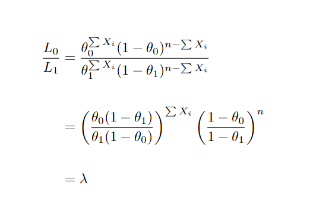

```{r setup, include=FALSE}
knitr::opts_chunk$set(echo = TRUE)
```

### Introdução

Existem duas grandes áreas da estatística, de maneira geral, a estimação de parâmetros e o teste de hipóteses. Testes de hipóteses, de maneira rapida e mais simples que posso explicar, de maneira bem redundante, é testar alguma afirmação, propondo a hipótese nula, hipótese a ser avaliada, e a hipótese alternativa, como o próprio nome induz, contrária a afirmativa principal.

Trazendo o problema para uma forma mais lúdica e explicativa, seria: Suponha que queremos saber qual marca de blusa dura mais tempo. É possível reescrever no formato de hipóteses da seguinte forma:


Utilizamos tal ferramenta para validação de espaço de possíveis valores para o parâmetro em estudo. Considere o seguinte cenário: uma empresa de lâmpadas deseja investigar o tempo de vida de seus produtos após alteração na linha de fabricação, se continua a mesma, ou se houve alguma melhora, considerando que como dono você espera que o tempo de vida de seus produtos aumentem. Partindo para uma abordagem estatística, assim como no estudo de estimação, assumiremos que é possível obter uma amostra aleatória X1,...,Xn de uma distribuição f(.;θ), uma hipótese estatística seria uma hipótese a respeito da distribuição da população.

É necessário estabelecer notações a priori para o estudo, Estatística de Teste: Pode ser descrito como a regra de rejeição para uma hipótese. Vamos tomar um exemplo para melhor compreensão:

Considere X1,...,Xn sendo uma amostra aleatória de uma f(x;θ). Considerando H0: θ \< 17. Um possível teste seria: Rejeite H0 se e somente se . Chamaremos esse conjunto de possíveis valores onde se rejeita H0 de **Região Crítica**, definindo de forma mais formal

-   **Região de Rejeição**: Considere ***X*** uma variável aleatória de uma distribuição dependente do parâmetro θ. Considere agora *T* = *r(X)* uma estatítisca, e *R* um subset de valores dos Reais. Suponha um procedimento de teste de hipóteses da forma "Rejeite H0 se *T* pertencer a *R*". Então *T* é uma estatística de teste e *R* é denominado de **Região de Rejeição** do teste.

Um teste pode ser tanto randômico quanto não randômico. O acima citado é um ótimo exemplo de teste não randomizado, uma possível alternativa para randômico seria: jogue uma moeda para o alto, caso cara rejeite a hipótese nula.

Exemplo: Suponha que **X** = (X1,...,Xn) é uma amostra aleatória de uma normal com média μ desconhecida e variância σ² conhecida. Queremos testar as hipóteses:


É sensato rejeitar H0 se  for muito discrepante de  . Por exemplo, nos poderiamos escolher um número *c* e rejeiar a hipótese se a distância de  para  fosse maior que *c*. Poderiamos definir então a região de não rejeição como sendo , logo seu complementar sendo a região de rejeição do teste. E a estatística de teste como sendo: .

#### Função Poder e Tipos de Erros

Para cada teste feito sobre uma amostra obtida por uma distribuição parametrizada em θ ∈ Θ, teremos uma função poder associada.

-   **Função Poder**: Assumindo um procedimento de teste δ. A função π(θ\|δ) é chamada função poder do teste δ. Se **S** denota a região crítica de δ, então a função poder é determinada pela relação:

 Para todo θ ∈ Θ.

Se δ é descrito em função da estatística de teste *T* e região de rejeição *R* então

 Para todo θ ∈ Θ.

Como a função poder é definida para todo espaço paramétrico, podemos descrever como sendo em função do espaço paramétrico supondo hipótese nula onde se espera o valor igual a 0, e em função do espaço da hipótese alternativa, se esperando o valor de 1 dentro desse intervalo, considerando que o poder nada mais é que a probabilidade de rejeitar H0 dado os possíveis valores de θ.

Exemplo: Se baseando no primeiro exemplo, onde temos uma normal com média conhecida e variância desconhecida e um R = [c,∞). A distribuição de  é uma normal de média μ e variância σ²/n conhecida. A função poder pode ser demonstrada como sendo:


Dentro do estudo, como comentado no inicio, testamos se a hipótese nula é falsa, assumindo então a alternativa como verdadeira, ou vice versa. Nesse contexto dois tipos de erros podem ser cometidos:

-   Erro do tipo I: Rejeitar a hipótese nula quando a mesma é verdadeira;

-   Erro do tipo II: Aceitar a hipótese nula quando a mesma é falsa. Finalizada nossa introdução a respeito do tema, partiremos para melhor especificação dos tipos de testes.

### Hipótese simples versus Hipótese simples

As hipóteses podem ser tanto simples quanto compostas, mas o que seria uma hipótese simples? São hipóteses onde é especificado completamente a distribuição (H: µ = 0), logo podemos assumir como compostas aquelas que não especificam completamente a distribuição (H:µ \>50). O caso em estudo de hipótese simples versus hipóteses simples não é realmente muito utilizado na prática, porém serve como ótima introdução ao tema.

#### Testes de razão de verossimilhança simples

Suponha X1,...,Xn sendo uma amostra aleatória de uma distribuição Fº(.) ou F¹(.), um teste de H0: Xi \~ Fº(.) versus H1: Xi \~ F¹(.) é um teste de razão de verossimilhança se é definido como:


Onde K é uma constante não negativa e L(x1,...,xn) a função de verossimilhança associada a função de densidade f(.). Rejeitamos a hipótese nula para um valor de lambda pequeno, pois, seguindo a linha de raciocínio da razão das funções, L¹ é maior que Lº, logo há mais indícios que nossa amostra venha de uma população com distribuição f¹(.) ao invés de uma fº(.).

Exemplo: Seja X1,...,Xn uma amostra de uma *N*(μ,1), onde queremos testar H0: μ = 0 x H1: μ = 1 . Nesse caso o teste de razão de verossimilhança pode ser dado por:


Ou seja, rejeitamos H0 para um somatório de x maior que alguma constante k\*.

#### Testes Mais Poderosos

Antes de realmente falar sobre testes mais poderosos, uma definição deve ser esclarecida, o ***tamanho do teste***, vamos supor um teste δ para a hipótese H0: θ ∈ Θº, onde Θº ⊂ Θ, ou seja Θº é um subset do espaço paramétrico Θ. O tamanho do teste pode ser definido como . Esclarecida esta definição, daremos prosseguimento com o assunto.

Assim como já comentado, queremos um teste δ onde π(θº) = P[Rejeitar H0 \| H0 verdadeiro] seja a menor possível, e que π(θ¹) = P[Rejeitar H0 \| H0 falsa] a maior possível. Em um mundo perfeito, π(θ¹) = 1 e π(θº) = 0, minimizando os dois tipos de erros citados no texto. Uma das metodologias aplicadas de forma a definir o melhor teste possível é fixando o erro do tipo I, minimizar o erro do tipo II.

-   **Teste Mais Poderoso**: Um teste δ\* de H0: θ = θº contra H1: θ = θ¹ é definido como teste mais poderoso de tamanho α(0 \< α \< 1) se e somente se:

(i) π(θº\|δ\*) = α
(ii) π(θ¹\|δ\*) \> π(θ¹\|δ) para qualquer outro teste δ onde π(θº\|δ) \< α

Ou seja, podemos considerar um teste δ\* como sendo o teste mais poderoso se para qualquer outro teste de tamanho α ou menor, possuir o maior poder.

O Lemma a seguir se vê muito útil em encontrar os testes acima destacados,

-   **Lemma Neyman-Pearson**: Dado X1,...,Xn uma amostra aleatória de uma distribuição f(x;θ), onde θ pode ser um dos dois valores θ¹ e θº, e fixando 0 \< α \< 1. Considere k\* uma constante possitiva e C\* um subset do espaço de valores para Xi, onde:

    

     

e λ \> k\* se 

Então temos que o teste para essa região crítica é o teste mais poderoso, considerando hipóteses simples. Vamos aplicar em um exemplo para melhor compreensão.

Exemplo: Seja X1,...,Xn uma amostra aleatória de uma Bernoulli(θ) e seja H0:θ = θ° versus H1: θ = θ¹, θ¹ \> θº. O teste mais poderoso de tamanho α para testar H0 contra H1 é da forma



onde _k_ e _γ_ é determinada de maneira que . Agora


e dado que θ¹ \> θº λ(x) é uma função crescente de .Segue então que λ(x) > k se, e somente se,  > k¹, sendo k¹ uma constante. Então, o teste
mais poderoso de tamanho α é da forma 


Também, k¹ e γ são determinados da forma


Observe que o teste mais poderoso de tamanho α é independente de θ¹ enquanto θ¹ > θº e é, portanto, o teste mais poderoso para verificar se θ = θº
contra θ > θº.

### Testes para hipóteses compostas

Após toda essa teoria nosso trabalho nessa sessão se torna mais simples, considerando que faremos nada mais que uma generalização para os teste de hipóteses compostos, usando como base toda parte explicada nas sessões anteriores. De forma inicial começaremos com o método mais geral para testar hipóteses, não sendo sempre o resultado mais preciso, mas sim o mais aplicável em todo tipo de caso.

Considere X1,...,Xn obtido de uma função de densidade f(x;θ),θ ∈ Θ, e um teste do tipo H0: θ ∈ Θ° contra H1: θ ∈ Θ¹ = Θ - Θ°.

-   **Teste de Razão de Verossimilhança Generalizada**: Suponha L(θ;X1,...,Xn) a função de verossimilhança para a amostra X1,...,Xn. O teste de razão de verossimilhança generalizada, denotado por λ é definido como:


Onde λ passa a ser uma função da amostra, definida no intervalo [0,1], que, assim como no Teste de Razão, rejeitamos para algum λ° \> λ, onde λ° é uma constante definida no intervalo [0,1].

Exemplo:

Seguindo com a generalização dos métodos, partimos para os **Testes Uniformememnte Mais Poderosos**, definindo da seguinte forma:

-   **Testes Uniformemente Mais Poderosos**: Um teste δ\* do tipo H0: θ ∈ Θ° contra H1: θ ∈ Θ¹ = Θ - Θ° é definido como Teste UMP de tamanho α se e somente se:

    

     Para todo θ ∈ Θ - Θ° e para qualquer teste δ de tamanho menor ou igual a α.

Exemplo:

### Conclusão

Podemos verificar nesse post, alguns dos métodos para testar hipóteses estatísticas, dos mais utilizados tanto no meio da graduação quanto profissional. Na literatura ainda possuímos varias outras formas, que fogem um pouco do escopo desse tutorial. Mas, mesmo o conhecimento limitado passado aqui, ainda será muito útil para aplicações em vários meios necessários. Alem de métodos para achar o melhor tipo de teste. Espero que o texto tenha sido esclarecedor e de ajuda ao leitor. Para mais informações ou dúvidas, segue email para contato: [samuel.martins7\@hotmail.com](mailto:samuel.martins7@hotmail.com){.email}
