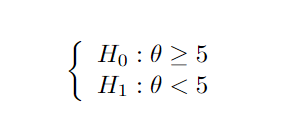

```{r setup, include=FALSE}
knitr::opts_chunk$set(echo = TRUE)
```

### Introdução

De maneira geral, existem duas grandes áreas na Estatística: a estimação de parâmetros e o teste de hipóteses. Em particular, testar hipóteses é testar uma hipótese nula contra uma hipótese alternativa, em que na hipótese nula ($H_0$) se faz uma afirmação a respeito de um parâmetro e na hipótese alternativa ($H_a$ ou ainda $H_1$) é informado o contrário dessa afirmação. 

Para deixar essa ideia um pouco mais clara, tomemos um exemplo: suponha que gostaríamos de saber qual marca, A ou B, de um determinado tipo de blusa dura mais tempo. Conseguimos reescrever esse problema em formato de hipóteses, a saber:




 Além disso, utilizamos teste de hipóteses para validar um espaço de possíveis valores para o parâmetro sob investigação (a média, por exemplo). Assim como no estudo de estimação, assumimos que é possível obter uma amostra aleatória X1,…,Xn de uma distribuição f(.;θ). Portanto, uma hipótese estatística seria uma hipótese a respeito da distribuição da população.

 Antes de mais nada, precisamos definir o que é uma estatística de teste. Estatística de teste pode ser descrita como a regra de rejeição para uma hipótese. Tomemos mais um exemplo: seja X1,…,Xn uma amostra aleatória de função densidade f(x;θ) e a hipótese nula a ser testada H0: θ < 17. Um possível teste seria rejeitar $H_0$ se e somente se  .  Formalmente, chamamos esse conjunto de possíveis resultados, para o qual se rejeita $H_0$, de região crítica.


Para entender melhor o conceito de região crítica (ou **região de rejeição**), vamos considerar outro exemplo: seja $X$ uma variável aleatória de uma distribuição dependente do parâmetro θ. Considere, agora, $T = r(X)$ uma estatística e $R$ um subconjunto de valores reais. Suponha um procedimento de teste de hipóteses da forma “rejeite $H_0$ se $T$ pertence à R”. Então, $T$ é uma estatística de teste e $R$ é a **região de rejeição** do teste.
Um teste pode ser tanto aleatório quanto não aleatório. O exemplo anterior, por exemplo, é um ótimo exemplo de teste não aleatório. Já um teste aleatório poderia ser "jogue uma moeda para o alto, caso cara rejeite a hipótese nula".


Um teste pode ser tanto randômico quanto não randômico. O acima citado é um ótimo exemplo de teste não randomizado, uma possível alternativa para randômico seria: jogue uma moeda para o alto, caso cara rejeite a hipótese nula.

Exemplo: Por último, vamos supor que $X = (X1,…,Xn)$ é uma amostra aleatória de uma distribuição Normal com média μ desconhecida e variância σ² conhecida. Queremos testar as hipóteses:


É sensato rejeitar $H_0$ se   for muito discrepante de   . Por exemplo, nós poderíamos escolher um número $c$ qualquer e rejeitar a hipótese nula se a distância de    para    for maior do que c. Assim, a estatística do teste seria dada por  , a região de não rejeição seria definida como  e seu complementar sendo, portanto, a região de rejeição do teste. 


#### Função Poder e Tipos de Erros
Para cada teste aplicado sobre uma amostra obtida de uma distribuição em que θ ∈ Θ, teremos uma função poder associada.
●	Função Poder: suponha um procedimento de teste δ. A função π(θ|δ) é chamada função poder do teste δ. Se $S$ denota a região crítica de δ, então a função poder é determinada pela relação:
 , para todo θ ∈ Θ.
Se δ é descrito em função da estatística de teste $T$ e da região de rejeição $R$, então
 , para todo θ ∈ Θ.
Como a função poder é definida para todo espaço paramétrico, podemos escrever o teste de hipóteses em função do espaço paramétrico, isto é, supondo a hipótese nula em que θ é igual a 0 e a hipótese alternativa em que θ é igual a 1. É importante dizer que o poder nada mais é do que a probabilidade de rejeitar $H_0$ dados os possíveis valores de θ.
Exemplo: considere o último exemplo da Introdução, em que lidamos com uma distribuição Normal com média desconhecida e variância conhecida e região crítica $RC = [c,∞)$. Logo, a distribuição de     também é uma normal de média μ, porém com variância σ²/n. E portanto, a função poder é dada por:


Como dito inicialmente, testamos se a hipótese nula é falsa e, portanto, se a hipótese alternativa é verdadeira, ou vice-versa. Nesse contexto, dois tipos de erros podem ser cometidos:
+	Erro do Tipo I: rejeitar a hipótese nula quando a mesma é verdadeira.
+	Erro do Tipo II: aceitar a hipótese nula quando a mesma é falsa. 


### Hipótese simples versus Hipótese simples

As hipóteses de um teste podem ser da forma simples ou composta. Em uma simples, é especificada completamente a distribuição de um parâmetro θ ($H_0: µ = 0$, como exemplo). Por outro lado, uma hipótese composta é aquela cuja distribuição ($H_0:µ >50$) não é especificada completamente. A discussão acerca de hipótese simples versus hipótese composta não é muito vista na prática, porém serve como ótima introdução ao tema.

#### Testes de razão de verossimilhança simples

Suponha X1,…,Xn sendo uma amostra aleatória de uma distribuição $fº(.)$ ou $f¹(.)$. Um teste de $H_0: Xi ~ fº(.)$ vs. $H_1: Xi ~ f¹(.)$ é um teste da razão de verossimilhança se é definido como:
onde $k$ é uma constante não negativa e $L(x_1,…,x_n)$ é a função de verossimilhança associada à função de densidade $f(.)$. Rejeitamos a hipótese nula para um valor de lambda pequeno, pois, seguindo a linha de raciocínio da razão das funções, $L¹$ é maior que $Lº$. Dessa forma, há mais indícios de que a amostra venha de uma população com distribuição $f¹(.)$ em vez de uma $fº(.)$.
Exemplo: seja $X_1,…,X_n$ uma amostra aleatória de uma distribuição $N(μ,1)$ na qual queremos testar $H_0: μ = 0$ \times $H_1: μ = 1$. Nesse caso, o teste da razão de verossimilhança pode ser dado por:

Ou seja, rejeitamos $H_0$ se o somatório de $x$ for maior do que alguma constante $k*$.


Ou seja, rejeitamos H0 para um somatório de $x$ maior que alguma constante k\*.

#### Testes Mais Poderosos
Antes de falar sobre os testes mais poderosos, uma definição deve ser esclarecida: o tamanho do teste. Vamos admitir um teste δ cuja hipótese nula seja $H_0: θ ∈ Θº$, em que Θº ⊂ Θ (ou seja, Θº é um subconjunto do espaço paramétrico Θ). Assim, o tamanho do teste é definido como  . Esclarecida essa definição, daremos prosseguimento ao assunto.
Assim como já comentado, queremos um teste δ em que π(θº) = P[Rejeitar H0 | H0 verdadeiro] seja a menor possível e que π(θ¹) = P[Rejeitar H0 | H0 falsa] seja a maior possível. Em um mundo perfeito, π(θ¹) = 1 e π(θº) = 0, isto é, quando os erros do tipo I e II são minimizados simultâneamente. Entretanto, na prática, uma das metodologias aplicadas de forma a definir o melhor teste possível é minimizar o erro do tipo II fixando o erro do tipo I.
 

**Teste Mais Poderoso**: Um teste δ* em que $H_0: θ = θº$ contra $H_1: θ = θ¹$ é definido como teste mais poderoso de tamanho α(0 < α < 1) se e somente se:
i.	π(θº|δ*) = α;
ii.	π(θ¹|δ*) > π(θ¹|δ), para qualquer outro teste δ onde π(θº|δ) < α.
Ou seja, podemos considerar um teste δ* como sendo o teste mais poderoso se, para qualquer outro teste de tamanho α ou menor do que α, ele possuir o maior poder.


O lema (ou método) a seguir é muito útil para encontrar testes mais poderosos.

+ **Lemma Neyman-Pearson:** seja $X_1,…,X_n$ uma amostra aleatória de uma distribuição com densidade f(x;θ), onde θ pode assumir os valores θ¹ ou θº e 0 < α < 1. Considere $k*$ uma constante positiva e C* um subconjunto do espaço de valores para $X_i$. Assim,


    

     

e λ \> k\* se 

Então, considerando um teste de hipóteses simples, temos que o teste para essa região crítica é o teste mais poderoso.
Vamos mostrar um exemplo para melhor compreensão.

 Exemplo: seja $X_1,…,X_n$ uma amostra aleatória de uma distribuição Bernoulli(θ) e seja o teste $H_0:θ = θ°$ vs. $H_1: θ = θ¹$, $θ¹ > θº$. O teste mais poderoso de tamanho α para testar $H_0$ contra $H_1$ é da forma


onde $k$ e $γ$ é determinada de maneira que  . Agora, se


dado que $θ¹ > θº$ e $λ(x)$ é uma função crescente de ,segue que $λ(x) > k$ se e somente se  > k¹, sendo $k¹$ uma constante. Então, o teste mais poderoso de tamanho α é da forma


Ainda, $k¹$ e $γ$ são determinados da forma


Observe que o teste mais poderoso de tamanho α é independente de $θ¹$ quando $θ¹ > θº$, e é, portanto, o teste mais poderoso para verificar se $θ = θº$ contra $θ > θº$. 

### Testes para hipóteses compostas

Após todos os conceitos visto até aqui, nosso trabalho passou a ser mais simples nesta seção, pois apenas generalizaremo-los para os teste de hipóteses compostos. A princípio, começaremos com o método mais geral para testar hipóteses, que, geralmente, não é o que fornece resultados mais precisos, mas é aplicável em todo tipo de situação.
Considere $X_1,…,X_n$ uma amostra aleatória obtida de uma função de densidade f(x;θ),θ ∈ Θ, e um teste do tipo $H_0: θ ∈ Θ°$ contra $H_1: θ ∈ Θ¹ = Θ - Θ°$.


-   **Teste de Razão de Verossimilhança Generalizada**: suponha $L(θ;X1,…,Xn)$ a função de verossimilhança para a amostra $X_1,…,X_n$. O teste de razão de verossimilhança generalizada, denotado por $λ$, é definido como:


onde λ se torna uma função da amostra definida no intervalo [0,1]. Assim como no Teste de Razão de Verossimilhança simples(?), rejeitamos a $H_0$ para algum λ° > λ, em que λ° é uma constante definida no intervalo [0,1].


Agora partimos para os Testes Uniformememnte Mais Poderosos, que tem como definição:

+	**Testes Uniformemente Mais Poderosos (TUMP)**: um teste δ* do tipo $H_0: θ ∈ Θ°$ contra $H_1: θ ∈ Θ¹ = Θ - Θ°$ é definido como TUMP de tamanho α se e somente se


    

     para todo θ ∈ Θ - Θ° e para qualquer teste δ de tamanho menor ou igual a α.


### Conclusão

Na literatura, podemos encontrar formas diferentes de testar hipóteses das vistas neste tutorial, mas elas fogem do escopo deste post e por isso não foram abordadas. Ainda assim, fomos capazes de aprender alguns dos métodos para testar hipóteses estatísticas mais utilizados no meio da graduação e também profissional, além de métodos para achar o melhor tipo de teste. Espero que o texto tenha sido esclarecedor e de ajuda ao leitor. Para mais informações ou dúvidas, escreva-nos em : [comunicacao@observatorioobstetricobr.org](mailto:comunicacao@observatorioobstetricobr.org){.email}
