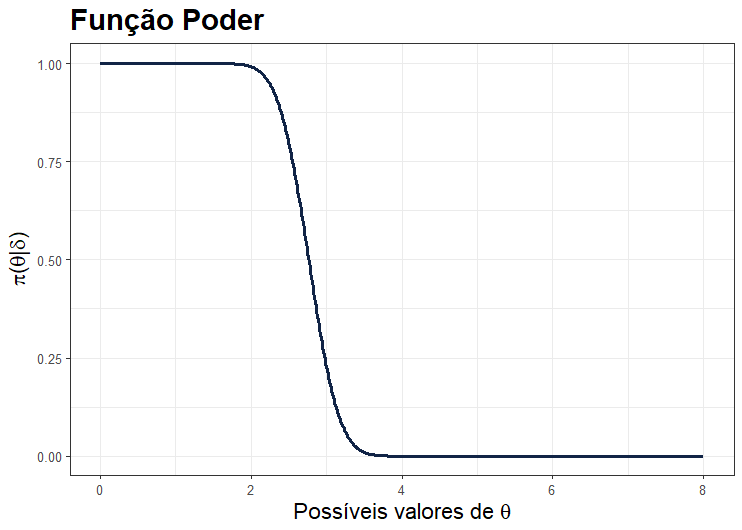

```{r setup, include=FALSE}
knitr::opts_chunk$set(echo = TRUE)
```

### Introdução

De maneira geral, existem duas grandes áreas na Estatística: a estimação de parâmetros e o teste de hipóteses (colocar o link do outro post). Em particular, o teste de hipoteses consiste em avaliar uma afirmação a respeito de um parâmetro (média, variância, proporção, etc.) ou um conjunto de parâmetros. Tal afirmação recebe o nome de de Hipótese Nula $(H_0)$, a afirmação alternativa recebe o nome de Hipótese Alternativa $(H_1)$.

Para deixar essa ideia um pouco mais clara, suponha que queremos saber qual marca, A ou B, de um determinado tipo de blusa dura mais tempo. Conseguimos reescrever esse problema na forma de um sistema de hipóteses, a saber:


Para realizar o teste, assumimos que é possível obter uma amostra aleatória $X_1,...,X_n$ de uma distribuição $f(.;θ)$.

Tambem é necessário definir a estatística de teste $(T)$ e região de rejeição $(R)$. Estatística de teste é um valor calculado a partir da amostra, seu valor define a regra de rejeição para uma hipótese, ele mostra o quanto seus dados observados correspondem à distribuição esperada sob a hipótese nula desse teste estatístico. Tomemos mais um exemplo: seja $X_1,...,X_n$ uma amostra aleatória do produto de marca A, obtidos de uma distribuição $f(.;\theta)$, onde $\theta$ é o parâmetro tempo de duração médio. Estamos interessados em saber se o tempo de duração da marca A é igual ou maior que 5 anos, ou em outras palavras $H_0 : \theta \geq 5$. Um possível teste seria rejeitar $H_0$ se $\hat{\theta} < 5 - 10/\sqrt{n}$, onde $\hat{\theta}$ é a estatística de teste $T$ e um estimador de $\theta$. Formalmente, chamamos esse conjunto de possíveis resultados, para o qual se rejeita $H_0$, de região crítica. Assumiremos $\delta$ como representação do procedimento de testes de hipótese no dercorrer do post.

 Um teste pode ser tanto aleatório quanto não aleatório. O exemplo anterior, por exemplo, é um ótimo exemplo de teste não aleatório. Já um teste aleatório poderia ser "jogue uma moeda para o alto, caso cara rejeite a hipótese nula".

#### Função Poder e Tipos de Erros

Para cada teste aplicado sobre uma amostra obtida de uma distribuição $f(.;\theta)$ onde $\theta \in \Theta$ em que $\Theta$ representa o espaço paramétricos de possíveis valores para $\theta$, teremos uma função poder associada. 
  
  ● Função Poder: suponha um procedimento de teste $\delta$. A função $\pi(\theta|\delta)$ é chamada função poder do teste $\delta$. Se $S_1$ denota a região de rejeição de $\delta$, então a função poder é determinada pela relação: 
  
   , para todo θ ∈ Θ.
  
  Se $\delta$ é descrito em função da estatística de teste $T$ e da região de rejeição $R$, então 
  
   , para todo θ ∈ Θ.
  
  Sendo a função poder, a probabilidade de rejeitar a hipótese nula dado os possíveis valores do parâmetro em estudo $\theta$, buscamos a o teste $\delta$ que minimize $\pi()$ para os valores de $\theta$ pertencentes ao espaço paramétrico de $H_0$ e a maximize quando $\theta$ pertence ao espaço paramétrico de $H_1$, ou em outras palavras, $\pi(\theta \in \Theta_0|\delta) = 0$ e $\pi(\theta \in \Theta_1|\delta) = 1$, onde $\Theta_0$ representa o espaço paramétrico sob a hipótese nula e $\Theta_1$ o espaço paramétrico sob a hipótese alternativa. Retomando o exemplo inicial onde rejeitamos a hipótese nula para $\hat{\theta} < 5 - 10/sqrt{n}$, suponha que uma amostra aleatória do produto A, $x_1,...,x_{20}$ foi obtida de uma distribuição Normal$(\theta,\sigma^2)$, com $\sigma^2$ conhecido e igual a 2, e $\hat{\theta} = \overline{x} $, onde $\overline{x}$ é definido como a média amostral. Obtendo, assim, a seguinte função poder,
  
   , 
   
onde $Z$ segue uma distribuição Normal$(0,1)$, tendo assim:

  
  

Como dito inicialmente, testamos se a hipótese nula é falsa e, portanto, se a hipótese alternativa é verdadeira, ou vice-versa. Nesse contexto, dois tipos de erros podem ser cometidos:

+ Erro do Tipo I: rejeitar a hipótese nula quando a mesma é verdadeira. 

+ Erro do Tipo II: aceitar a hipótese nula quando a mesma é falsa.

### Hipótese simples

As hipóteses de um teste podem ser da forma simples ou composta. Uma hipótese simples, é aquela onde o espaço de possíveis valores de $\theta$ é definido em apenas um ponto, onde a distribuição do parâmetro é completamente especificada ($H_0: \theta = \theta_0, f(.;\theta_0)$ por exemplo). Por outro lado, uma hipótese composta é aquela cuja distribuição não é especificada completamente e $\theta$ pode assumir um conjunto de valores $\Theta$ ($H_0: \theta \in \Theta$, $f(.;\Theta)$ por exemplo). A discussão acerca de hipótese simples versus hipótese simples não é muito vista na prática, porém serve como ótima introdução ao tema.

#### Testes de razão de verossimilhança simples

Suponha que $X_1,...,X_n$  uma amostra aleatória de uma distribuição $f_0(.;\theta_0)$ ou $f_1(.;\theta_1)$. Um teste de $H_0: \theta = \theta_0$ vs. $H_1: \theta = \theta_1$ é um teste da razão de verossimilhança se é definido como: onde $k$ é uma constante não negativa e $L(x_1,…,x_n)$ é a função de verossimilhança associada à função de densidade $f(\cdot)$. Rejeitamos a hipótese nula para um valor de $\lambda = L_0(\cdot)/L_1(\cdot)$ inferior a k, pois, seguindo a linha de raciocínio da razão das funções, $L_1(\cdot)$ é maior que $L_0(\cdot)$, nos dando mais indícios de que a amostra venha de uma população com distribuição $f_1(\cdot)$ em vez de uma $f_0(\cdot)$. Exemplo: seja $X_1,…,X_n$ uma amostra aleatória de uma distribuição $N(\theta,1)$ na qual queremos testar $H_0: \theta = 0$ \times $H_1: \theta = 1$. Tendo a função de verossimilhança como:

 

Obtendo o teste de razão de verossimilhança,


Ou seja, rejeitamos $H_0$ para um somatório de $x$ maior que alguma constante k\*.

#### Testes Mais Poderosos

Antes de falar sobre os testes mais poderosos, uma definição deve ser esclarecida: o tamanho do teste. Vamos admitir um teste $\delta$ cuja hipótese nula seja $H_0: \theta \in \Theta_0$ ($H_0 : \theta < \theta_0$, por exemplo), em que  $\theta$ ⊂ $\Theta_0$ (ou seja, $\Theta_0$ é um subconjunto do espaço paramétrico $\Theta$). Assim, o tamanho do teste é definido como  . Esclarecida essa definição, daremos prosseguimento ao assunto. Assim como já comentado, queremos um teste $\delta$ em que $\pi(\theta_0|\delta)$ = P[Rejeitar $H_0$ \| $H_0$ verdadeiro] seja a menor possível e que $\pi(\theta_1)$ = P[Rejeitar $H_0$ \| $H_0$ falsa] seja a maior possível. Em um mundo perfeito, $\pi(\theta_1)$ = 1 e $\pi(\theta_0)$ = 0, isto é, quando os erros do tipo I e II são minimizados simultâneamente. Entretanto, na prática, uma das metodologias aplicadas de forma a definir o melhor teste possível é minimizar o erro do tipo II fixando o erro do tipo I.

**Teste Mais Poderoso**: Um teste $\delta*$ em que $H_0: \theta = \theta_0$ contra $H_1: \theta = \theta_1$ é definido como teste mais poderoso de tamanho α(0 \< α \< 1) se e somente se: 

i. $\pi(\theta|\delta*)$ = α; 

ii. $\pi(\theta_1|\delta*)$ \> $\pi(\theta_1|\delta)$, para qualquer outro teste $\delta$ onde $\pi(\theta_0|\delta)$ \< α. 

Ou seja, podemos considerar um teste $\delta*$ como sendo o teste mais poderoso se, para qualquer outro teste de tamanho α ou menor do que α, ele possuir o maior poder.

O lema (ou método) a seguir é muito útil para encontrar testes mais poderosos.

-   **Lemma Neyman-Pearson:** seja $X_1,...,X_n$ uma amostra aleatória de uma distribuição com densidade $f(x;\theta)$, onde $\theta$ pode assumir os valores $\theta_1$ ou $\theta_0$ e 0 \< α \< 1. Considere $k*$ uma constante positiva e C\* um subconjunto do espaço de valores para $X_i$. Assim,

    

     

e $\lambda$ \> k\* se 

Então, considerando um teste de hipóteses simples, temos que o teste para essa região crítica é o teste mais poderoso. Vamos mostrar um exemplo para melhor compreensão.

Exemplo: seja $X_1,...,X_n$ uma amostra aleatória de uma distribuição Bernoulli($\theta$) e seja o teste $H_0:\theta = \theta_0$ vs. $H_1: \theta = \theta_1$, $\theta_1 > \theta_0$. O teste mais poderoso de tamanho α para testar $H_0$ contra $H_1$ é da forma


onde $k$ e $γ$ é determinada de maneira que . Agora, se


dado que $\theta_1 > \theta_0$ e $\lambda(x)$ é uma função crescente de ,segue que $\lambda(x) > k$ se e somente se  \> $k_1$, sendo $k_1$ uma constante. Então, o teste mais poderoso de tamanho α é da forma


Ainda, $k_1$ e $\gamma$ são determinados da forma


Observe que o teste mais poderoso de tamanho α é independente de $θ¹$ quando $\theta_1 > \theta_0$, e é, portanto, o teste mais poderoso para verificar se $\theta = \theta_0$ contra $\theta > \theta_0$.

### Testes para hipóteses compostas
Generalizaremo-los para os teste de hipóteses compostos. A princípio, começaremos com o método mais geral para testar hipóteses, que, geralmente, não é o que fornece resultados mais precisos, mas é aplicável em todo tipo de situação. Considere $X_1,...,X_n$ uma amostra aleatória obtida de uma função de densidade $f(x;\theta)$, $\theta \in \Theta$, e um teste do tipo $H_0: \theta \in \Theta_0$ contra $H_1: \theta \in \Theta_1 = \Theta - \Theta_0$.

-   **Teste de Razão de Verossimilhança Generalizada**: suponha $L(θ;X1,...,Xn)$ a função de verossimilhança para a amostra $X_1,...,X_n$. O teste de razão de verossimilhança generalizada, denotado por $\lambda$, é definido como:


onde λ se torna uma função da amostra definida no intervalo [0,1]. Assim como no Teste de Razão de Verossimilhança para hipóteses simples, rejeitamos a $H_0$ para algum λ° \> λ, em que λ° é uma constante definida no intervalo [0,1].

-   **Testes Uniformemente Mais Poderosos (TUMP)**: um teste δ\* do tipo $H_0: θ ∈ Θ°$ contra $H_1: θ ∈ Θ¹ = Θ - Θ°$ é definido como TUMP de tamanho α se e somente se

    

     para todo θ ∈ Θ - Θ° e para qualquer teste δ de tamanho menor ou igual a α.

### Conclusão

Na literatura, podemos encontrar formas diferentes de testar hipóteses das vistas neste tutorial, mas elas fogem do escopo deste post e por isso não foram abordadas. Ainda assim, fomos capazes de aprender alguns dos métodos para testar hipóteses estatísticas mais utilizados, além de métodos para achar o melhor tipo de teste. Espero que o texto tenha sido esclarecedor e de ajuda ao leitor. Para mais informações ou dúvidas, escreva-nos em : [comunicacao\@observatorioobstetricobr.org](mailto:comunicacao@observatorioobstetricobr.org){.email}
