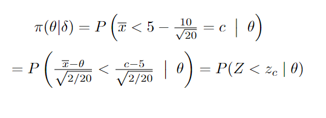

### Introdução

De maneira geral, existem duas grandes áreas na inferência Estatística: a estimação de parâmetros (Para mais informações sobre estimação, verifique nosso post sobre [função de Verossimilhança](https://observatorioobstetricobr.org/livro-e-tutoriais/funcao-de-verossimilhanca/)), e o teste de hipóteses. Em particular, o teste de hipoteses consiste em avaliar uma afirmação a respeito de um parâmetro (média, variância, proporção, etc.) ou um conjunto de parâmetros. Tal afirmação recebe o nome de Hipótese Nula (Denotado por $H_0$), a afirmação alternativa recebe o nome de Hipótese Alternativa (Denotado por $H_1$).

Para deixar essa ideia um pouco mais clara, suponha que queremos saber se uma determinada marca de blusa *A*, possui um tempo médio de duração (Denotado por $\theta$) igual ou superior a 5 anos. Conseguimos reescrever essa indagação na forma de um sistema de hipóteses, a saber:

 

Para realizar o teste, assumimos que é possível obter uma amostra aleatória de blusas da marca *A*, $X_1,...,X_n$, de uma distribuição $f(.;\theta)$.

Tambem é necessário definir a estatística de teste $(T)$ e região de rejeição $(R)$. Estatística de teste é um valor calculado a partir da amostra, seu valor define a regra de rejeição para uma hipótese, ele mostra o quanto seus dados observados correspondem à distribuição esperada sob a hipótese nula desse teste estatístico, denotamos por $R$ os possíveis valores para $\theta$ em que, dado a regra de rejeição, rejeitamos $H_0$. Estamos interessados em saber se o tempo de duração da marca A é igual ou maior que 5 anos, ou em outras palavras $H_0 : \theta \geq 5$. Um possível teste seria rejeitar $H_0$ se $\overline{x} < 5 - 10/\sqrt{n}$, onde $\overline{x}$ é a estatística de teste $T$, nesse caso nossa estatística acaba por ser o estimador de $\theta$, digamos média amostral. No exemplo em questão, nossa região de rejeição são todos os possíveis valores de $\overline{x} < 5- 10/\sqrt{n}$. Assumiremos $\delta$ como representação do procedimento de testes de hipótese no dercorrer do post.

Um teste pode ser tanto aleatório quanto não aleatório. O exemplo anterior, por exemplo, é um ótimo exemplo de teste não aleatório. Já um teste aleatório poderia ser "jogue uma moeda para o alto, caso cara rejeite a hipótese nula".

Tão importante quanto conhecer os tipos de teste é a verificação da "qualidade" de um teste, ou o quão correto estamos ao rejeitar uma hipótese. Podemos analisar esses resultados observando a função poder bem como os tipos de erros que podemos cometer dentro de um procedimento de testes de hipóteses

### Função Poder e Tipos de Erros

Para cada teste aplicado sobre uma amostra obtida de uma distribuição $f(.;\theta)$ onde $\theta \in \Theta$ em que $\Theta$ representa o espaço paramétricos de possíveis valores para $\theta$, teremos uma função poder associada. A função poder define a probabilidade, dado um valor de $\theta$, de rejeitar $H_0$ dado que a mesma é falsa, ou seja, o quão acertivo foi nossa escolha dado o espaço paramétrico. Suponha um procedimento de teste $\delta$, ou seja, possuímos uma regra de rejeição e uma estatística de teste obtidos através de uma amostra aleatória. A função $\pi(\theta|\delta)$ é chamada função poder do teste $\delta$. Se $S_1$ denota a região de rejeição de $\delta$, então a função poder é determinada pela relação:

 

Se $\delta$ é descrito em função da estatística de teste $T$ e da região de rejeição $R$, então

para todo $\theta \in \Theta$.

Sendo a função poder, a probabilidade de rejeitar a hipótese nula dado os possíveis valores do parâmetro em estudo $\theta$, buscamos o teste $\delta$ que minimize $\pi(.)$ para os valores de $\theta$ pertencentes ao espaço paramétrico de $H_0$ e a maximize quando $\theta$ pertence ao espaço paramétrico de $H_1$, ou em outras palavras, $\pi(\theta \in \Theta_0|\delta) = 0$ e $\pi(\theta \in \Theta_1|\delta) = 1$, onde $\Theta_0$ representa o espaço paramétrico sob a hipótese nula e $\Theta_1$ o espaço paramétrico sob a hipótese alternativa. 

Retomando o exemplo inicial onde rejeitamos a hipótese nula para $\overline{x} < 5 - 10/\sqrt{n}$, suponha que uma amostra aleatória do produto A, $X_1,...,X_{20}$ foi obtida de uma distribuição Normal$(\theta,\sigma^2)$, com $\sigma^2$ conhecido e igual a 2, onde $\overline{x}$ é o estimador de máxima verossimilhaça para média amostral. Obtendo, assim, a seguinte função poder,

onde $Z$ segue uma distribuição Normal$(0,1)$, obtendo assim:

Perceba que, para os valores de $\theta$ dentro do espaço paramétrico de $H_0$ ($\theta \geq 5$) o valor para função poder é 0.

Ao considerar como possível escolha, rejeição ou não rejeição da hipótese nula, testamos uma hipótese contra a outra. Dentro deste cenário encontramos dois tipos de erros, os chamados:

-   Erro do Tipo I: rejeitar a hipótese nula quando a mesma é verdadeira. Para o exemplo em questão, assumir que a marca *A* dura em média menos que 5 anos, quando o tempo é superior a 5 anos.

-   Erro do Tipo II: aceitar a hipótese nula quando a mesma é falsa. Assumindo por exemplo que o tempo de duração é superior ou igual a 5 anos quando na verdade o tempo é inferior.

É possível indicar a probabilidade de ocorrência de cada erro, para o exemplo trabalhado na sessão, por meio da seguinte notação para o Erro do Tipo I:

e para o Erro do Tipo II:

Dado que $\beta$ é a probabilidade de não rejeitar $H_0$ quando a mesma é falsa, 1 - $\beta$ pode ser definido como a probabilidade de rejeitar $H_0$ quando falsa, sendo também nossa função poder.

É relacionado para cada regra de rejeição, ou valor crítico de $\overline{x}$, um valor para $\alpha$ e $\beta$. No procedimento de teste de hipótese à medida que um dos erros é minimizado, o outro tipo de erro é incrementado. Podemos optar pela escolha de uma regra de rejeição que equilibre os dois tipos de erro, ou seja $\beta = \alpha$, ou o mais usual e mais aplicado, a escolha de um valor arbitrário fixo para $\alpha$, também chamado de nível de significância do teste, digamos valores como 10%, 5% ou 1%. Há também casos em que o erro do tipo II é o fixado, digamos: o erro não é a melhor alternativa, mas caso haja algum erro, que seja por rejeitar a hipótese nula quando a mesma é verdadeira. Esse tipo de abordagem pode ser vista em estudos de eficácia de remédio ou em outras aplicações na área da saúde. Por isso um bom entendimento do problema aplicado é necessário em todo caso.

### Tipos de Hipóteses

As hipóteses de um teste podem ser da forma simples ou composta. Uma hipótese simples, é aquela onde o espaço de possíveis valores de $\theta$ é definido em apenas um ponto, dessa forma a distribuição do parâmetro é completamente especificada ($H_0: \theta = \theta_0, f(.;\theta_0)$, ou ainda $H_0: \theta = 5$). Por outro lado, uma hipótese composta é aquela cuja distribuição não é especificada completamente e $\theta$ pode assumir um conjunto de valores $\Theta$ ($H_0: \theta \in \Theta$, $f(.;\Theta)$, ou $H_0: \theta \geq 5$). Uma forma de introduzir o tema, é observar primeiro o contexto de Hipóteses simples versus Hipótese simples, ou em outras palavras:

#### Testes de razão de verossimilhança simples

Suponha que temos uma amostra aleatória $X_1,...,X_n$ de uma distribuição com parâmetro $\theta$ que pode ser $\theta_0$ ou $\theta_1$. Para testar a hipótese nula $H_0: \theta = \theta_0$ versus a hipótese alternativa $H_1: \theta = \theta_1$, podemos utilizar um teste de razão de verossimilhança. Esse teste envolve a comparação da função de verossimilhança $L(x_1,…,x_n)$ associada à densidade $f(\cdot)$, utilizando a razão $\lambda = L_0(\cdot)/L_1(\cdot)$, onde $L_0(\cdot)$ e $L_1(\cdot)$ representam as funções de verossimilhança quando $\theta = \theta_0$ e $\theta = \theta_1$, respectivamente. Se $\lambda$ é menor do que uma constante não negativa $k$, rejeitamos a hipótese nula, sugerindo que a amostra pode vir de uma população com distribuição $f_1(\cdot)$ em vez de $f_0(\cdot)$. Por exemplo, podemos testar a duração da marca de blusa, agora digamos $H_0: \theta = 5$ versus $H_1: \theta = 7$ (onde $\theta$ ainda representa o tempo de duração médio em anos), para uma amostra aleatória de uma distribuição normal $N(\theta,1)$, utilizando a função de verossimilhança.

Obtendo o teste de razão de verossimilhança,

Que pode ser reescrito como

Ou seja, rejeitamos $H_0$ para um somatório de $X_i$ maior que alguma constante k\*. Suponha uma amostra de $\sum^6_{i=1} X_i = 36$, rejeitamos $H_0$ se $36 > (12 - \log(k))/2$ ou $k < 8,75\times 10^{-27}$, note que, para a amostra em questão, temos um valor para $\lambda$ extremamente baixo, logo podemos rejeitar a hipótese de tempo de duração igual a 5 anos, optando pela alternativa de 7 anos de duração. Ou em outras palavras, os dados obtidos pela amostra mostram indícios de que a distribuição original da população não siga a proposta pela hipótese nula, e sim pela alternativa.

Para cada $k$ fixado é tido um teste diferente. Uma forma de verificar o melhor $k$ descrito é pela análise da função poder discutida anteriormente para cada um dos testes, que pode ser visto também pela análise do teste Mais Poderoso, que minimize o erro proveniente do processo de teste de hipótese.

Antes de falar sobre os testes mais poderosos, uma definição deve ser esclarecida: o tamanho do teste. Vamos admitir um teste $\delta$ cuja hipótese nula seja $H_0: \theta \in \Theta_0$ ($H_0 : \theta < \theta_0$, ou $H_0 : \theta = \theta_0$ por exemplo), em que $\Theta_0 \subset \Theta$ (ou seja, $\Theta_0$ é um subconjunto do espaço paramétrico $\Theta$). Assim, o tamanho do teste é definido como $\sup\limits_{\theta \in \Theta^0}[\pi(\theta\mid\delta)]$ onde $\pi(\theta\mid\delta)$ é a função poder de $\theta$ dado o procedimento de teste $\delta$. Ou em outras palavras, o valor para $\theta$ dentro do espaço paramétrico da hipótese nula que maximiza a função poder associada ao procedimento de teste de hipótese $\delta$.

Esclarecida essa definição, daremos prosseguimento ao assunto. Assim como já comentado, queremos um teste $\delta$ em que $\pi(\theta_0\mid\delta)$ = P(Rejeitar $H_0$ \| $H_0$ verdadeiro) seja a menor possível e que $\pi(\theta_1\mid\delta)$ = P(Rejeitar $H_0$ \| $H_0$ falsa) seja a maior possível. Em um mundo ideal, $\pi(\theta_1)$ = 1 e $\pi(\theta_0)$ = 0, isto é, quando os erros do tipo I e II são minimizados simultâneamente. Entretanto, na prática, uma das metodologias aplicadas, como já citado, de forma a definir o melhor teste possível é minimizar o erro do tipo II fixando o erro do tipo I.

**Teste Mais Poderoso**: Um teste $\delta*$ em que $H_0: \theta = \theta_0$ contra $H_1: \theta = \theta_1$ é definido como teste mais poderoso de tamanho $\alpha$, com $0 < \alpha < 1$, se e somente se:

i.  $\sup\limits_{\theta \in \Theta^0}\pi(\theta|\delta*) = \alpha$;

ii. $\pi(\theta_1|\delta*)$ \> $\pi(\theta_1|\delta)$, para qualquer outro teste $\delta$ onde $\pi(\theta_0|\delta)  \leq \alpha$.

Ou seja, podemos considerar um teste $\delta*$ como sendo o teste mais poderoso se, para qualquer outro teste de tamanho $\alpha$ ou menor do que $\alpha$, ele possuir o maior poder.

O lemma a seguir é muito útil para encontrar testes mais poderosos.

-   **Lemma Neyman-Pearson:** seja $X_1,...,X_n$ uma amostra aleatória de uma distribuição com densidade $f(x;\theta)$, onde $\theta$ pode assumir os valores $\theta_1$ ou $\theta_0$ e 0 \< $\alpha$ \< 1. Considere $k*$ uma constante positiva e C\* um subconjunto do espaço de valores para $X_i$. Assim,

e $\lambda$ \> k\* se $(x_1,...,x_n) \in \overline{C}*$. Onde $C*$ é a região de rejeição e $\overline{C}*$ seu complementar.

Então, considerando um teste de hipóteses simples, temos que o teste para essa região de rejeição é o teste mais poderoso. Vamos mostrar um exemplo para melhor compreensão.

Seja $X_1,...,X_n$ uma amostra aleatória da marca *A*, onde estamos interessados em saber se o motivo do baixo tempo de duração foi erro da fábrica ou não, para isso suponha que a amostra segue distribuição Bernoulli($\theta$), onde $X_i = 1$, foi erro da fábrica e $X_i = 0$ caso contrário. Seja o teste $H_0:\theta = \theta_0$ vs. $H_1: \theta = \theta_1$, $\theta_1 > \theta_0$, onde $\theta$ representa a proporção de blusas com baixo tempo de duração por erro da fábrica. Então

Rejeitamos $H_0$ para um $\lambda \leq k*$, note porém, que $\lambda$ varia em função da amostra $X_1,\dots,X_n$. Podendo considerar as outras informações como constantes, nos levando a rejeitar $H_0$ se $\sum X_i \geq k'$. Para compreender suponha $\theta_0 = 0.3$ e $\theta_1 = 0.5$ e uma amostra de tamanho 10.

Conforme incrementamos o valor do somatório, diminuimos o valor de $\lambda$, logo rejeitamos $H_0$ para um valor do somatório maior que uma constante $k'$, ou seja, rejeitamos a hipótese de que a proporção de blusas por erro da fabrica seja 0.3 e optamos pela proporção de 0.5 caso o número de blusas com defeito por culpa da fábricação seja relativamente alto.

Perceba porém, que ao trabalharmos com uma variável de contagem ($\sum X_i \sim Binomial(n,\theta)$), não se torna tão simples assim fixar o valor de $\alpha$ de forma arbitrária como fariamos em um teste para variáveis contínuas para encontrar o teste mais poderoso, já que $k*$ pode assumir apenas valores inteiros. Lembrando que $\alpha = P(\sum X_i \geq k' \mid \theta = 0.3)$, fazendo o processo inverso, onde fixamos os possíveis valores de $k'$ ($0\leq k' \leq 10$), obtemos os seguintes tamanhos de teste $\alpha$:

|                     | k = 1 | k = 2 | k = 3 | k = 4 | k = 5 | k = 6 | k = 7 |
|---------------------|-------|-------|-------|-------|-------|-------|-------|
| Valores de $\alpha$ | 0.851 | 0.617 | 0.35  | 0.15  | 0.047 | 0.011 | 0.002 |

Ou seja, o teste mais poderoso de tamanho $\alpha = 0.15$ é aquele em que rejeitamos $H_0$ para um $\sum X_i \geq 4$, e assim sucessivamente.

Note que o teste mais poderoso de tamanho $\alpha$, dado o lemma de Neyman-Pearson é necessariamente um teste de razão de verossimilhança simples.

### Testes para hipóteses compostas

Generalizaremo, agora, para os teste de hipóteses compostas. O método mais geral para testar hipóteses, que, geralmente não é o que fornece resultados mais precisos, mas é aplicável em todo tipo de situação, é o Teste de Razão de Verossimilhança Generalizado. Considere $X_1,...,X_n$ uma amostra aleatória obtida de uma função de densidade $f(. ;\theta)$, $\theta \in \Theta$, e um teste do tipo $H_0: \theta \in \Theta_0$ contra $H_1: \theta \in \Theta_1 = \Theta - \Theta_0$.

-   **Teste de Razão de Verossimilhança Generalizado**: suponha $L(\theta;X_1,...,X_n)$ a função de verossimilhança para a amostra $X_1,...,X_n$. O teste de razão de verossimilhança generalizada, denotado por $\lambda$, é definido como:

Onde $\lambda$ se torna uma função da amostra definida no intervalo [0,1]. Assim como no Teste de Razão de Verossimilhança para hipóteses simples, rejeitamos a hipótese nula ($H_0$) se o valor de $\lambda$ for menor ou igual a uma constante $k^*$ definida no intervalo [0,1]. Quanto mais próximo de 1 for o valor de $\lambda$, mais difícil será rejeitar a hipótese nula, pois indica que o valor que maximiza a função de verossimilhança dentro do espaço paramétrico da hipótese nula está se aproximando do valor que maximiza para o espaço paramétrico total.

-   **Testes Uniformemente Mais Poderosos (UMP)**: um teste $\delta*$ do tipo $H_0: \theta \in \Theta_0$ contra $H_1: \theta \in \Theta_1 = \theta - \Theta_0$ é definido como UMP de tamanho $\alpha$ se e somente se

(i) $\sup\limits_{\theta \in \Theta^0}[\pi(\theta\mid\delta*)] = \alpha$

(ii) $\pi(\theta\mid\delta*) > \pi(\theta\mid\delta)$

para todo $\theta \in \Theta - \Theta_0$ e para qualquer teste $\delta$ de tamanho menor ou igual a $\alpha$.

Suponha o exemplo onde testamos $H_0: \theta \geq 0.5$ versus $H_1: \theta < 0.5$, sendo $\theta$ a proporção de blusas com pouco tempo de duração por culpa da fábrica, e que possuimos uma amostra $X_1,...X_{30} \sim Bernoulli(\theta)$, onde $\sum_{i=1}^{30}X_i = 12$. Primeiro, faremos de forma geral onde $0.5 = \theta_0$ e depois substituiremos pelos valores propostos. Então, o valor que maximímiza a função de verossimilhança no espaço paramétrico geral e sob $H_0$ seguem da forma:

Assim,

Substituindo pelos valores propostos no problema então obtemos que $\lambda = 2.33\times 10^{-9}$, pois $0.5 \geq \sum X_i/n$, rejeitando $H_0$ para um $2.33\times 10^{-9} < k$. É possível notar, porém, que $\lambda$ é função de $\sum X_i$ e que $lambda$ é descrescente conforme incrementado o valor de $\sum X_i$, logo rejeitamos $H_0$ para um $\sum X_i > k'$. Como explicado então, o teste UMP para o exemplo é aquele em que $\sup\limits_{0.5 \leq \theta \leq 1}P(\sum X_i > k'\mid \theta) = \alpha$ ou  $P(\sum X_i > k'\mid \theta \geq 0.5) = \alpha$

### Conclusão

Na literatura, podemos encontrar formas diferentes de testar hipóteses das vistas neste tutorial, mas elas fogem do escopo deste post e por isso não foram abordadas. Ainda assim, fomos capazes de aprender alguns dos métodos para testar hipóteses estatísticas mais utilizados, além de métodos para achar o melhor tipo de teste. Espero que o texto tenha sido esclarecedor e de ajuda ao leitor. Para mais informações ou dúvidas, escreva-nos em : [comunicacao\@observatorioobstetricobr.org](mailto:comunicacao@observatorioobstetricobr.org){.email}
